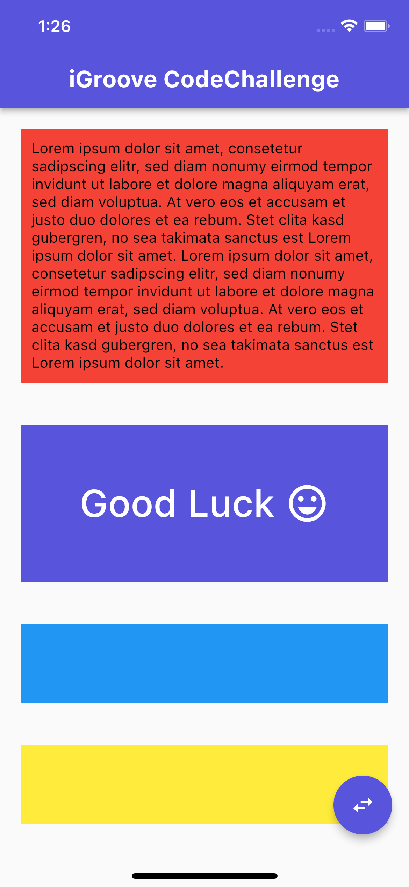

# iGroove Code Challenge

#### iGroove challenge as solved by Macheza Dzabala.

## Getting Started

To get started with this project ensure you have the [Flutter SDK](https://docs.flutter.dev/get-started/install) installed.

Ensure you have at least an emulator installed on your local machine or connect to a physical mobile device.

Guides for that can be found [here](https://docs.flutter.dev/get-started/test-drive).

Follow the following instructions to deploy the application to your device or emulator:

1. Clone this Repository

2. Run `flutter pub get`

3. Run `flutter run`

## How I solved the challenge

1. I simply wrapped the text that is bound in the red container inside a `Flexible` widget and removed the fixed height of the container. This ensures that the text can be resized to fit the container.

2. I created a simple Stream to listen and emit an event every second. The reason I chose this approach is because streams are considered constants and therefore can update values inside stateless widgets. This is a good approach to keep the code clean and easy to understand.

3. I used a `StreamBuilder` to listen to the stream and wrapped the expanding container inside the stream builder. This keeps our code simple and performant.

4. I further created a scroll update trigger and passed it to the `CodeChallenge` widget. This ensures that we do not receive any `Called on Null` errors when we scroll inside our `Reorderable GridView`.

5. Minor refactoring was done in order to make the code more readable and maintainable. I believe that separating code and keeping code units as small as possible results in better written tests.

## Developer

Github - [Cheza-Dzabala](https://github.com/Cheza-Dzabala/)

Twitter - [@chezaguy](https://twitter.com/chezaguy)

LinkedIn - [@cheza-dzabala](https://www.linkedin.com/in/cheza-dzabala/)
